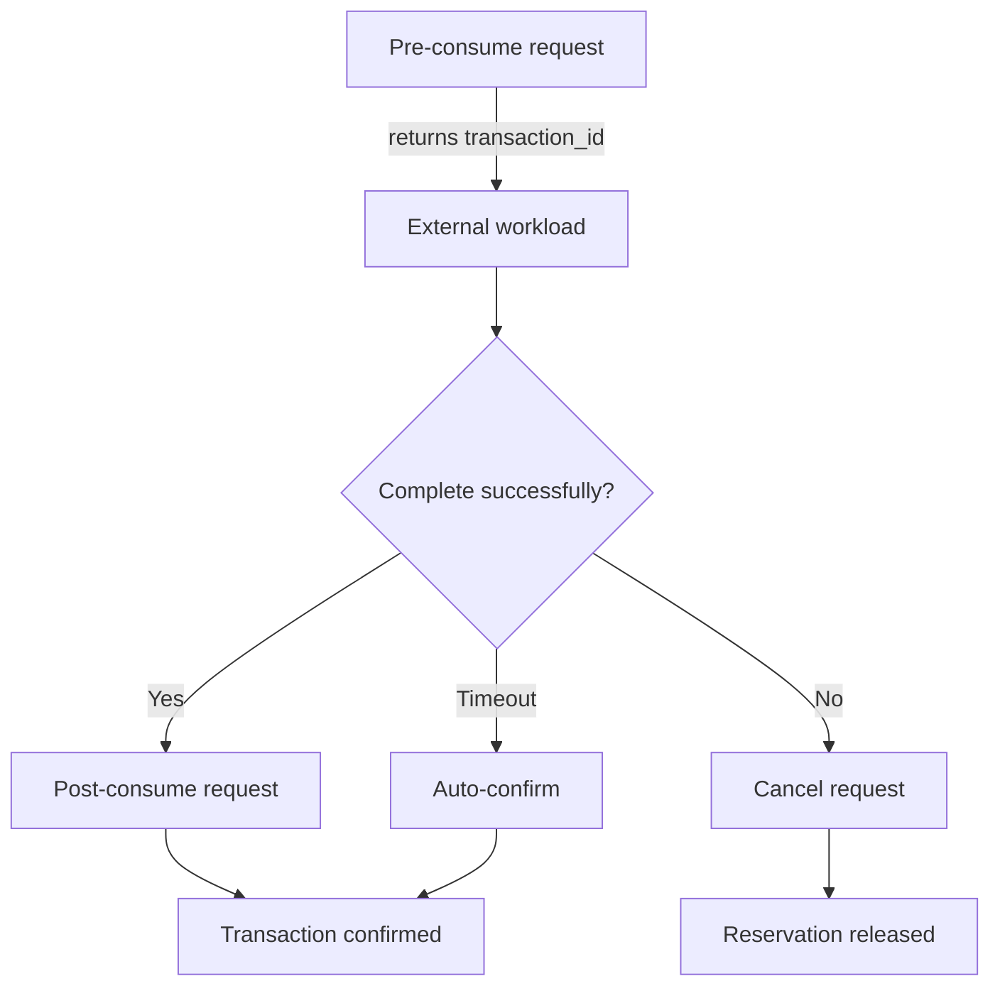

# External Billing Integration Guide

This guide explains how external services can report usage to One-API using the `/api/token/consume` endpoint. It covers the lifecycle of billing events, how transaction identifiers are managed, example requests, and integration best practices.

## Menu

- [External Billing Integration Guide](#external-billing-integration-guide)
  - [Menu](#menu)
  - [Implementation Mapping](#implementation-mapping)
  - [Key Concepts](#key-concepts)
  - [Dependencies \& Prerequisites](#dependencies--prerequisites)
  - [Authentication](#authentication)
  - [End-to-End Flow (Pre → Post)](#end-to-end-flow-pre--post)
    - [1. Pre-Consume Reservation](#1-pre-consume-reservation)
    - [2. Post-Consume Reconciliation](#2-post-consume-reconciliation)
    - [Optional: Cancel a Pending Reservation](#optional-cancel-a-pending-reservation)
  - [Single-Step Consumption (`phase":"single"`)](#single-step-consumption-phasesingle)
    - [Request Payload Fields](#request-payload-fields)
    - [Response Payload](#response-payload)
      - [Sample `post` Response](#sample-post-response)
  - [Balance Queries](#balance-queries)
  - [Transaction Record Queries](#transaction-record-queries)
  - [Usage Log Queries](#usage-log-queries)
  - [Flow Overview](#flow-overview)
  - [Timeout \& Auto-Confirmation Lifecycle](#timeout--auto-confirmation-lifecycle)
  - [Operational Considerations](#operational-considerations)
  - [Error Handling \& Retries](#error-handling--retries)
  - [Best Practices](#best-practices)
  - [Additional Notes](#additional-notes)

## Implementation Mapping

- All features described here are implemented in `controller/token.go` and `model/token_transaction.go`.
- Timeouts are clamped to project config: `EXTERNAL_BILLING_DEFAULT_TIMEOUT` and `EXTERNAL_BILLING_MAX_TIMEOUT` (see `common/config/config.go`).
- Legacy clients omitting `phase` are handled as `single` internally, performing pre and post in one step.
- Transaction records are stored in the `token_transactions` table (see migration in `model/main.go`).
- All quota changes and transaction events are logged for audit and reconciliation.

## Key Concepts

- **Transactions** – Each external billing event is tracked by a transaction stored in the `token_transactions` table. Transactions encapsulate both reservations and final reconciliations.
- **Consume phases** – One-API supports four phases:
  - `pre` – Reserve quota before an asynchronous job finishes.
  - `post` – Finalize a prior reservation with the authoritative usage total.
  - `cancel` – Release a pending reservation without charging quota.
  - `single` – Legacy shortcut that performs `pre` and `post` in a single call.
- **Transaction IDs** – One-API generates a unique transaction ID during `pre` and `single` phases and returns it in the response. Clients must supply that ID when issuing `post` or `cancel` calls.
- **Timeouts** – Each reservation has a configurable expiration window. If the timeout elapses with no `post` or `cancel`, One-API auto-confirms using the reserved amount.

**Timeouts are always clamped to the configured minimum and maximum. If a client requests a value outside this range, One-API will use the nearest allowed value.**

**Legacy clients (no `phase` field) are treated as `single` phase, which performs reservation and confirmation in one request.**

## Dependencies & Prerequisites

- **Authenticated token** – Every request must present a bearer token whose API key is enabled, unexpired, and has sufficient quota. Requests fail with validation errors if the key has been disabled, expired, or exhausted (see `validateTokenForConsumption`).
- **Network reachability** – The external system must reach the One-API host and HTTPS endpoint (`/api/token/consume`). Timeouts should align with One-API’s own request timeout (`BILLING_TIMEOUT`).
- **Configuration constants** – Reservation windows are governed by `EXTERNAL_BILLING_DEFAULT_TIMEOUT` (default 600s) and capped by `EXTERNAL_BILLING_MAX_TIMEOUT` (default 3600s). Values outside this range are clamped server-side (`normalizeTimeoutSeconds`).
- **Quota balance** – `pre` and `single` phases atomically reserve quota via `PreConsumeTokenQuota`, verifying both token-level and user-level quotas before committing the hold. The upstream caller should be prepared for `400` errors when quota is insufficient.
- **Idempotent storage** – Clients must persist the returned `transaction.transaction_id` reliably; it is required for `post`/`cancel` and is unique per token (`generateTransactionID`).

## Authentication

All examples assume you are calling One-API with a valid token. Replace `<ONE_API_TOKEN>` with your API key.

```text
Authorization: Bearer <ONE_API_TOKEN>
Content-Type: application/json
```

## End-to-End Flow (Pre → Post)

1. **Create reservation (`phase":"pre"`)**
2. **Run your workload**
3. **Finalize consumption (`phase":"post"`)**

### 1. Pre-Consume Reservation

```bash
curl -X POST https://oneapi.laisky.com/api/token/consume \
  -H "Authorization: Bearer <ONE_API_TOKEN>" \
  -H "Content-Type: application/json" \
  -d '{
    "phase": "pre",
    "add_reason": "async-transcode",
    "add_used_quota": 150,
    "timeout_seconds": 600
  }'
```

**Successful response:**

```json
{
  "success": true,
  "message": "",
  "data": {
    "id": 1,
    "remain_quota": 9850,
    "unlimited_quota": false,
    "name": "transcode-token"
  },
  "transaction": {
    "transaction_id": "8ac38e33-6c7f-4059-9cb3-f6d32df29f35",
    "status": "pending",
    "pre_quota": 150,
    "expires_at": 1735694025,
    "auto_confirmed": false
  }
}
```

Store the `transaction.transaction_id` value. You must send it back when finishing or canceling the job.

### 2. Post-Consume Reconciliation

```bash
curl -X POST https://oneapi.laisky.com/api/token/consume \
  -H "Authorization: Bearer <ONE_API_TOKEN>" \
  -H "Content-Type: application/json" \
  -d '{
    "phase": "post",
    "transaction_id": "8ac38e33-6c7f-4059-9cb3-f6d32df29f35",
    "add_reason": "async-transcode",
    "final_used_quota": 120,
    "elapsed_time_ms": 10875
  }'
```

`final_used_quota` may differ from the reservation. One-API refunds or consumes the delta automatically.

### Optional: Cancel a Pending Reservation

```bash
curl -X POST https://oneapi.laisky.com/api/token/consume \
  -H "Authorization: Bearer <ONE_API_TOKEN>" \
  -H "Content-Type: application/json" \
  -d '{
    "phase": "cancel",
    "transaction_id": "8ac38e33-6c7f-4059-9cb3-f6d32df29f35",
    "add_reason": "async-transcode"
  }'
```

Cancellation refunds the reserved quota in full and marks the transaction as `canceled`.

## Single-Step Consumption (`phase":"single"`)

If you prefer a single request (for synchronous workloads), omit the `phase` field or set it to `"single"`:

```bash
curl -X POST https://oneapi.laisky.com/api/token/consume \
  -H "Authorization: Bearer <ONE_API_TOKEN>" \
  -H "Content-Type: application/json" \
  -d '{
    "add_reason": "sync-generate",
    "add_used_quota": 35
  }'
```

The response includes a `transaction` object with status `confirmed` and the generated transaction ID for audit purposes.

### Request Payload Fields

| Field              | Required For     | Description                                                                                              |
| ------------------ | ---------------- | -------------------------------------------------------------------------------------------------------- |
| `phase`            | optional         | `"pre"`, `"post"`, `"cancel"`, or omitted/`"single"` for single-step billing.                            |
| `add_used_quota`   | `pre`, `single`  | Reservation amount in quota units. Also used as fallback during `post` if `final_used_quota` is missing. |
| `final_used_quota` | `post`           | Authoritative consumption amount. Optional; defaults to `add_used_quota`.                                |
| `add_reason`       | all phases       | Human-readable context stored in audit logs.                                                             |
| `transaction_id`   | `post`, `cancel` | ID returned from One-API during `pre`/`single`. Ignored for `pre`/`single` requests.                     |
| `timeout_seconds`  | optional (`pre`) | Overrides the auto-confirm window (clamped to project configuration).                                    |
| `elapsed_time_ms`  | optional         | Upstream processing latency captured in logs.                                                            |

### Response Payload

Every successful call returns the updated token snapshot in `data` and, when applicable, a `transaction` object describing the hold or reconciliation. The `transaction` object includes:

| Field                          | Description                                                                                                         |
| ------------------------------ | ------------------------------------------------------------------------------------------------------------------- |
| `id`                           | Internal database identifier of the transaction.                                                                    |
| `transaction_id`               | Client-facing identifier that must be reused in later phases.                                                       |
| `status_code` / `status`       | Numeric and string representations of the transaction state (`pending`, `confirmed`, `auto_confirmed`, `canceled`). |
| `pre_quota`                    | Reserved quota recorded during the `pre` phase.                                                                     |
| `final_quota`                  | Final reconciled quota; `null` while the transaction is pending.                                                    |
| `auto_confirmed`               | Indicates whether the server auto-confirmed the hold after timeout.                                                 |
| `expires_at`                   | UNIX timestamp (seconds) when the pending hold will auto-confirm. Set to `0` once confirmed/canceled.               |
| `confirmed_at` / `canceled_at` | Timestamps for terminal states, when applicable.                                                                    |
| `reason`                       | Copy of `add_reason` stored for auditing.                                                                           |
| `request_id` / `trace_id`      | Correlators linked to the originating One-API request.                                                              |
| `log_id`                       | Associated audit log record, if any.                                                                                |
| `elapsed_time_ms`              | Optional latency metric copied from the request (only persisted when > 0).                                          |

#### Sample `post` Response

```json
{
  "success": true,
  "message": "",
  "data": {
    "id": 1,
    "remain_quota": 9730,
    "unlimited_quota": false,
    "name": "transcode-token"
  },
  "transaction": {
    "transaction_id": "8ac38e33-6c7f-4059-9cb3-f6d32df29f35",
    "status": "confirmed",
    "status_code": 2,
    "pre_quota": 150,
    "final_quota": 120,
    "auto_confirmed": false,
    "expires_at": 0,
    "reason": "async-transcode",
    "confirmed_at": 1735694100
  }
}
```

## Balance Queries

Authenticated services can query the current quota balance of the token by calling the `/api/token/balance` endpoint.

```bash
curl -X GET https://oneapi.laisky.com/api/token/balance \
  -H "Authorization: Bearer <ONE_API_TOKEN>"
```

**Successful response:**

```json
{
  "success": true,
  "message": "",
  "data": {
    "remain_quota": 9730,
    "used_quota": 270,
    "unlimited_quota": false
  }
}
```

## Transaction Record Queries

To retrieve a history of external billing transactions associated with the token, use the `/api/token/transactions` endpoint. This endpoint supports pagination via `p` (page number, 0-indexed) and `size` (items per page) query parameters. The total number of retrievable records is capped (default 1000, configurable via `TOKEN_TRANSACTIONS_MAX_HISTORY`).

```bash
curl -X GET "https://oneapi.laisky.com/api/token/transactions?p=0&size=10" \
  -H "Authorization: Bearer <ONE_API_TOKEN>"
```

**Successful response:**

```json
{
  "success": true,
  "message": "",
  "data": [
    {
      "id": 1,
      "transaction_id": "8ac38e33-6c7f-4059-9cb3-f6d32df29f35",
      "token_id": 1,
      "user_id": 1,
      "status": 2,
      "pre_quota": 150,
      "final_quota": 120,
      "reason": "async-transcode",
      "request_id": "req_123",
      "trace_id": "trace_456",
      "expires_at": 0,
      "confirmed_at": 1735694100,
      "canceled_at": null,
      "auto_confirmed": false,
      "log_id": 42,
      "elapsed_time_ms": 10875,
      "created_at": 1735694000000,
      "updated_at": 1735694100000
    }
  ],
  "total": 1
}
```

## Usage Log Queries

To retrieve general model usage logs (ChatCompletion, Embeddings, etc.) associated with the token, use the `/api/token/logs` endpoint. This filtered view only shows logs where the `token_name` matches current token.

```bash
curl -X GET "https://oneapi.laisky.com/api/token/logs?p=0&size=10" \
  -H "Authorization: Bearer <ONE_API_TOKEN>"
```

**Successful response:**

```json
{
  "success": true,
  "message": "",
  "data": [
    {
      "id": 123,
      "user_id": 1,
      "created_at": 1735694000,
      "type": 2,
      "content": "Model chat completion",
      "token_name": "transcode-token",
      "model_name": "gpt-4o",
      "quota": 100,
      "request_id": "req_abc"
    }
  ],
  "total": 1
}
```

## Flow Overview



## Timeout & Auto-Confirmation Lifecycle

- The controller runs `autoConfirmExpiredTokenTransactions` at the start of every `/api/token/consume` invocation. Any pending holds whose `expires_at` is in the past are atomically marked `auto_confirmed`, preserving the originally reserved `pre_quota` without additional quota adjustments.
- Auto-confirmed transactions update their associated audit log entry through `buildAutoConfirmLogContent`, so downstream systems can detect stale jobs.
- To avoid unwanted auto-confirmation, supply a realistic `timeout_seconds` during the `pre` phase. Requests outside the configured range are clamped to the nearest bound.
- If a job finishes after auto-confirmation, a subsequent `post` call will fail because the transaction is no longer `pending`. In that case, reconcile differences by creating a new `single` transaction covering the delta.

## Operational Considerations

- **Error handling** – Validation failures (missing fields, exhausted quota, terminal transaction states) return `400` responses with descriptive error messages. Unknown transaction IDs return `404`. Retryable server-side issues surface as `429`/`5xx`; callers should use exponential backoff.
- **Idempotency strategy** – Once a transaction leaves the `pending` state, repeated `post`/`cancel` calls respond with an error describing the current status. Clients should treat such errors as a signal that the earlier attempt already succeeded and reconcile locally.
- **Logging & auditing** – Each phase appends to the consumption log (`model.RecordConsumeLog`). The `log_id` included in the response enables cross-referencing UI audit tables with transaction metadata.
- **Quota adjustments** – `post` reconciles differences between reserved and final usage by charging or refunding the delta via `PostConsumeTokenQuota`. Passing a larger `final_used_quota` than was reserved is allowed, provided quota remains available.
- **Elapsed time metrics** – The server only persists `elapsed_time_ms` when the provided value is positive. Use this field to surface upstream processing latency in internal dashboards.

## Error Handling & Retries

- **HTTP status 400** – Validation error (e.g., missing `transaction_id` on `post`). Fix the payload before retrying.
- **HTTP status 404** – Unknown token or transaction. Ensure you store the transaction ID returned from the `pre`/`single` response.
- **HTTP status 429/5xx** – Transient issues. Retry with backoff. The reservation remains until auto-confirmation.

## Best Practices

- Persist the transaction ID immediately after receiving it from the `pre`/`single` response.
- Call `post` (or `cancel`) before the timeout to avoid auto-confirming the reserved amount.
- Use `elapsed_time_ms` sparingly—only for completed jobs with reliable timing data.
- Monitor the transaction logs via the admin UI or database for auditing and reconciliation.
- Review architectural details in `docs/arch/api_billing.md` for deeper insight into pricing calculations and quota handling.

With this workflow, external systems can safely synchronize their usage with One-API while maintaining accurate quota accounting and audit trails.

## Additional Notes

- Transaction status codes: `pending`, `confirmed`, `auto_confirmed`, `canceled` (see `TokenTransactionStatus*` in code).
- Transaction IDs are unique per token and generated by One-API. Always persist and echo them for post/cancel.
- All error responses are wrapped and returned with context; see controller for details.
- For deeper architectural details, see `docs/arch/api_billing.md` and the code comments in `controller/token.go` and `model/token_transaction.go`.
